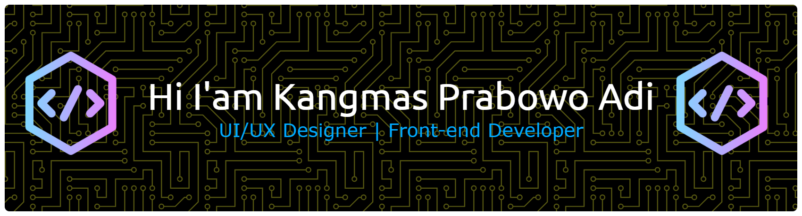

# 💁 Hi, I'm Kangmas Prabowo Adi SanjayaTvNews 🌱  
 

---

# 🌐 Connect with Me

---

# 🛠 Accounts I Manage

---

# 💻 Tech Stack
<!-- Ini Bagian Icon -->

<!-- Ini Bagian Badge -->

---

# 📊 GitHub Stats

 

 

---

